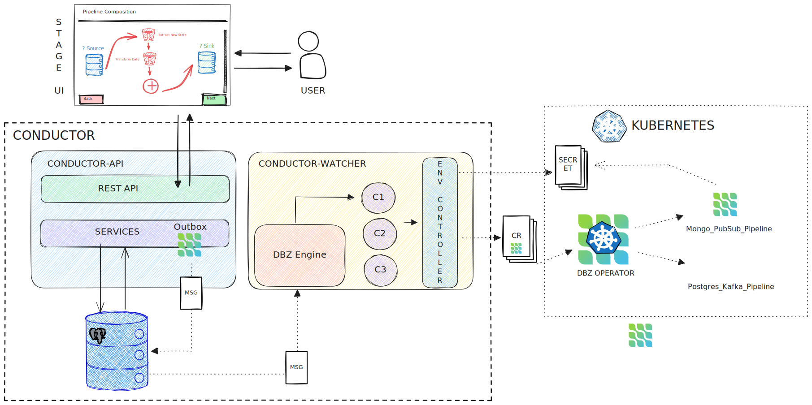

# Debezium Management Platform 

Debezium Management Platform (Debezium Orchestra) aims to provide means to simplify the deployment of 
Debezium to various environments in highly opinionated manner. The goal is not to provide 
total control over environment specific configuration. To achieve this goal the platform uses
a data-centric view on Debezium components.

**Disclaimer**: This project is still in early development stage and should not be used in production.

## Platform Architecture
The platform is composed of the following main components:

1. Conductor: The back-end component which provides a set of APIs to orchestrate and control Debezium deployments.
2. Stage: The front-end component which provides a user interface to interact with the Conductor.
3. Monitoring: Built-in pipeline monitoring powered by OpenTelemetry and Prometheus. Debezium Server instances export metrics via OpenTelemetry to an OTel Collector, which exposes them to Prometheus.


### Conductor Architecture
The conductor component itself is composed of several subcomponents:

1. API Server: The main entry point for the platform. It provides a set of APIs to interact with the platform.
2. Watcher: Component responsible for the actual communication with deployment environment (e.g. Debezium Operator in K8s cluster). 




## Installation

You can install the platform through helm chart. For instructions refer to the [README](helm/README.md)

## Run the example

If you don't have already a Kubernetes cluster up, you can use one of the commons tools to have a local K8s cluster

* [minikube](https://minikube.sigs.k8s.io/docs/) 
* [kind](https://kind.sigs.k8s.io/)

If you are using `kind` locally, expose ports `80` and `443` on the control-plane node so the ingress can be reached from your host:

```yaml
kind: Cluster
apiVersion: kind.x-k8s.io/v1alpha4
nodes:
- role: control-plane
  extraPortMappings:
    - containerPort: 80
      hostPort: 80
      listenAddress: "127.0.0.1"
      protocol: TCP
    - containerPort: 443
      hostPort: 443
      listenAddress: "127.0.0.1"
      protocol: TCP
```

```shell
kind create cluster --config kind-ingress.yaml
```

The prerequisite is to install an ingress controller.

For example, on `kind` you can install `ingress-nginx` with:

```shell
helm upgrade --install ingress-nginx ingress-nginx \
  --repo https://kubernetes.github.io/ingress-nginx \
  --namespace ingress-nginx \
  --create-namespace \
  --set controller.hostPort.enabled=true
```

For this example, considering a local setup, we will use the `/etc/hosts` to resolve the domain.

The following script will map the K8s IP to the specified domain into the `/etc/hosts`.

```shell
export DEBEZIUM_PLATFORM_DOMAIN=platform.debezium.io
sudo ./examples/update_hosts.sh
```

> **_NOTE:_**
If you are using minikube on Mac, you need also to run the `minikube tunnel` command. For more details see [this](https://minikube.sigs.k8s.io/docs/drivers/docker/#known-issues) and [this](https://stackoverflow.com/questions/70961901/ingress-with-minikube-working-differently-on-mac-vs-ubuntu-when-to-set-etc-host).

> **_NOTE:_**
If you are using Windows, add `127.0.0.1 platform.debezium.io` to `C:\Windows\System32\drivers\etc\hosts`.

Install the [OpenTelemetry Operator](https://github.com/open-telemetry/opentelemetry-operator) for pipeline monitoring:

```shell
helm repo add open-telemetry https://open-telemetry.github.io/opentelemetry-helm-charts
helm install opentelemetry-operator open-telemetry/opentelemetry-operator \
  -n opentelemetry-operator-system --create-namespace \
  --set admissionWebhooks.certManager.enabled=false \
  --set admissionWebhooks.autoGenerateCert.enabled=true
```

> **_NOTE:_** The above command uses Helm auto-generated self-signed certificates for the operator webhooks, which is suitable for development but not for production (certificates expire after 365 days without auto-renewal). For production environments, use a proper certificate management solution such as [cert-manager](https://cert-manager.io/) or provide your own certificates. See the [OTel Operator Helm chart documentation](https://github.com/open-telemetry/opentelemetry-helm-charts/tree/main/charts/opentelemetry-operator) for all available options.

Install the [Prometheus Operator](https://github.com/prometheus-operator/prometheus-operator) for metrics scraping:

```shell
helm repo add prometheus-community https://prometheus-community.github.io/helm-charts
helm install kube-prometheus-stack prometheus-community/kube-prometheus-stack -n monitoring --create-namespace
```

Create a dedicated namespace

```shell
kubectl create ns debezium-platform
```

and then install *debezium-platform* through `helm`

```shell
cd helm && 
helm dependency build &&
helm install debezium-platform . -n debezium-platform -f ../examples/example.yaml &&
cd ..
```

after all pods are running you should access the platform UI from `http://platform.debezium.io/`

To finish the example we will create a PostgreSQL, that will be used as source database,
and a kafka cluster, used as destination in our example pipeline.

```shell
# Deploy the source database

kubectl create -n debezium-platform -f examples/k8s/database/001_postgresql.yml
```

Install the Strimzi operator 

```shell
helm repo add strimzi https://strimzi.io/charts/ &&
helm repo update strimzi &&
helm install strimzi-operator strimzi/strimzi-kafka-operator --version 0.45.1 --namespace debezium-platform
```

```shell
# Deploy the kafka cluster

kubectl create -n debezium-platform -f examples/k8s/kafka/001_kafka.yml
```

```shell
# Create a test pipeline
#
# The script uses the `http` command from HTTPie.

./examples/seed.sh platform.debezium.io 80 examples/payloads/
```

And that's all. 


You should have a test pipeline configured to move data from PostgreSQL to Kakfa.


